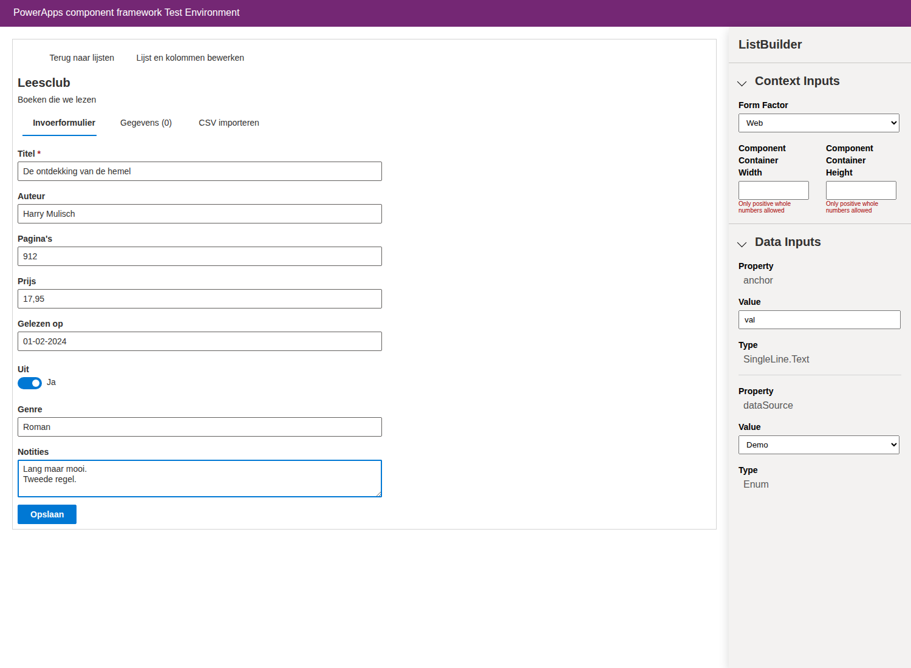
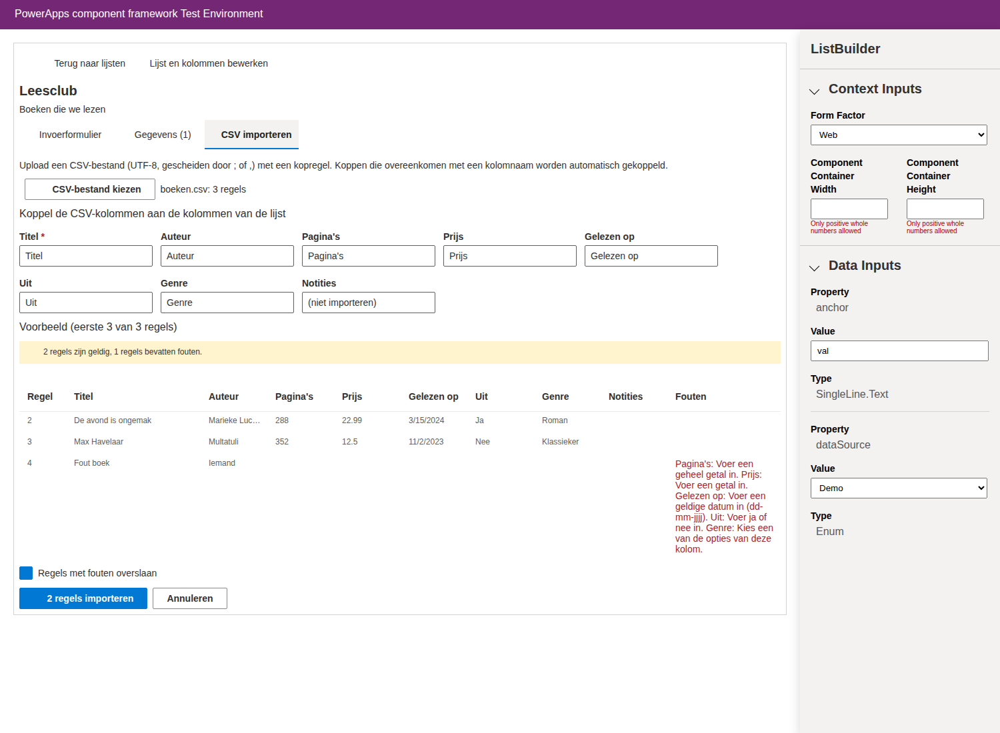

---
languages:
  - typescript
products:
  - power-platform
  - power-apps
page_type: sample
description: "This sample shows a React code component that lets users create their own lists with typed columns, and enter data with an input form or a CSV upload."
---

# List Builder (Lijstjesmaker) component framework sample

The List Builder component lets users create their own lists without customizing Dataverse:

- **Create a list** with a name, a description, a department and a process.
- **Define the columns** of the list and choose a data type for each column: text, multiline text, whole number, decimal number, date, yes/no or choice (with your own options). Columns can be marked as required and reordered.
- **Enter data** with an input form that is generated from the columns, with validation for each data type.
- **Upload data** from a CSV file. The CSV headers are linked to the columns automatically, every row is validated and you see a preview with the errors before importing.
- View, edit and delete the rows of a list.

The user interface is available in Dutch (1043) and English (1033).





## How it works

The component is a virtual React control that uses [Fluent UI](https://developer.microsoft.com/fluentui) and the [Web API](https://learn.microsoft.com/power-apps/developer/component-framework/reference/webapi) of the component framework.

Creating a Dataverse table for every list would require every user to have customization privileges and would add a lot of tables. Instead, the lists are stored in three fixed tables (a *generic data model*):

| Table | Columns | Purpose |
| --- | --- | --- |
| `sample_lijst` (Lijst) | `sample_name`, `sample_omschrijving`, `sample_afdeling`, `sample_proces` | A list with its name, description, department and process (free text) |
| `sample_lijstkolom` (Lijstkolom) | `sample_name`, `sample_sleutel`, `sample_datatype`, `sample_opties`, `sample_verplicht`, `sample_volgorde`, `sample_lijstid` | A column of a list and its data type. `sample_opties` holds the options of a choice column as a JSON array. |
| `sample_lijstregel` (Lijstregel) | `sample_name`, `sample_waarden`, `sample_lijstid` | A data row of a list. `sample_waarden` holds the values as a JSON object, for example `{"titel":"Max Havelaar","pagina_s":352,"gelezen_op":"2023-11-02","uit":false}` |

Each column gets a key (`sample_sleutel`) that never changes, so renaming a column keeps its data. The data type of a column can't be changed once the list contains data. Deleting a list deletes its columns and rows.

Values are stored as JSON numbers, booleans and strings. Dates are stored as `yyyy-mm-dd`, choices as the text of the option.

### Source files

| File | Description |
| --- | --- |
| `ListBuilder/index.ts` | The control. Chooses the data service and renders the app. |
| `ListBuilder/components/ListOverview.tsx` | The overview of all lists |
| `ListBuilder/components/ListDesigner.tsx` | Name, description and columns of a list |
| `ListBuilder/components/ListData.tsx` | Tabs with the input form, the data and the CSV import |
| `ListBuilder/components/RowForm.tsx` | The input form, with a field for each column |
| `ListBuilder/components/CsvImport.tsx` | Upload, column mapping, validation preview and import of a CSV file |
| `ListBuilder/services/DataverseListService.ts` | Stores the lists in Dataverse with `context.webAPI` |
| `ListBuilder/services/InMemoryListService.ts` | Keeps demo data in memory, for the test harness |
| `ListBuilder/utils/values.ts` | Parsing, validation and formatting of values per data type |
| `ListBuilder/utils/csv.ts` | CSV parser |
| `setup/Create-ListTables.ps1` | Creates the three tables in your environment (alternative to the solution) |
| `solution/build_solution.py` | Builds the importable solution zip from `solution/templates` |

## Compatibility

This sample works for model-driven apps. It uses the Web API, which is available to code components in model-driven apps.

## Applies to

[Power Apps component framework](https://learn.microsoft.com/power-apps/developer/component-framework/overview)

Get your own free development tenant by subscribing to [Power Apps Developer Plan](https://learn.microsoft.com/power-platform/developer/plan).

## Contributors

This sample was created by the community.

## Version history

| Version | Date               | Comments        |
| ------- | ------------------ | --------------- |
| 1.0     | September 30, 2026 | Initial release |

## Prerequisites

- [Install the Microsoft Power Platform CLI](https://learn.microsoft.com/power-platform/developer/cli/introduction).
- To create the tables: PowerShell 7.4 or later with the [Az PowerShell module](https://learn.microsoft.com/powershell/azure/install-azure-powershell). See [dataverse/webapi/PS](../../dataverse/webapi/PS/README.md).

## Try this sample

### Fastest way: import the solution

[solution/ListBuilderSolution_1_0_0_0.zip](solution/ListBuilderSolution_1_0_0_0.zip) contains everything in one unmanaged solution: the three tables, the code component, a model-driven app **Lijstjes** and a security role **Lijstjes gebruiker**.

1. Go to [make.powerapps.com](https://make.powerapps.com), select your environment and choose **Solutions** > **Import solution**. Select the zip and import it.
1. Give the users the security role **Lijstjes gebruiker** in addition to **Basic User**. With this role every user manages their own lists.
1. Open the app **Lijstjes**. Select **+ New** to create a list, save it, and open the tab **Kolommen en gegevens** to define the columns and enter or upload data.

The solution uses the publisher `examplepublisher` with the prefix `sample`, like the other samples. Don't also run `setup/Create-ListTables.ps1` in the same environment; both create the same tables.

> The solution was assembled by `solution/build_solution.py` from templates based on solutions exported by Dataverse. If the import reports an error, please open an issue with the error message.

To rebuild the zip after changing the control (only Python 3 is needed, no .NET SDK or Power Platform CLI):

```bash
npm install
npm run build -- --buildMode production
python3 solution/build_solution.py
```

### Try it in the test harness

The test harness doesn't support the Web API, so the control has a **Data source** property. Set it to **Demo** to keep the lists in memory:

```bash
npm install
npm start
```

In the test harness, set **dataSource** to **Demo** under *Data Inputs*.

### Alternative: set it up yourself

1. Create the tables in your environment. The script creates the `examplepublisher` publisher (prefix `sample`), the `listbuildersample` solution and the three tables. You can run it more than once.

   ```powershell
   ./setup/Create-ListTables.ps1 -environmentUrl 'https://yourorg.crm.dynamics.com/'
   ```

1. Follow the steps in the [README.md](../README.md) to generate a solution with the control and import it in your environment.
1. Give the users a security role with create, read, write and delete privileges on the `Lijst`, `Lijstkolom` and `Lijstregel` tables. With user level privileges every user sees their own lists; with organization level read privileges users can see each other's lists.
1. Add the control to a form. The control needs a single line of text column to be placed on, but it doesn't use its value. For example, add a text column to a table of your choice, add that column to a one-column section on the main form, and change its component to **List Builder** with the **Data source** property set to **Dataverse**. Hide the label of the column to use the whole width.

### CSV files

- The first line must contain the headers. Headers that match a column name are linked to that column automatically; you can change the links before importing.
- The file must be saved as UTF-8 (in Excel: *CSV UTF-8*). Both `;` and `,` are supported as separator.
- Numbers can use a decimal comma or a decimal point (`12,50` or `12.50`). A single separator is always read as the decimal separator.
- Dates can be written as `dd-mm-yyyy`, `dd/mm/yyyy` or `yyyy-mm-dd`.
- Yes/no values can be `ja`/`nee`, `yes`/`no`, `true`/`false` or `1`/`0`.
- Choice values must match one of the options of the column (not case sensitive).

[assets/voorbeeld.csv](assets/voorbeeld.csv) is an example for a list with the columns *Titel* (text), *Auteur* (text), *Pagina's* (whole number), *Prijs* (decimal number), *Gelezen op* (date), *Uit* (yes/no), *Genre* (choice: Roman, Klassieker, Thriller) and *Notities* (multiline text).

## Related information

- [Implementing Web API component](https://learn.microsoft.com/power-apps/developer/component-framework/sample-controls/webapi-control)
- [React controls & platform libraries](https://learn.microsoft.com/power-apps/developer/component-framework/react-controls-platform-libraries)
- [Create and update table definitions using the Web API](https://learn.microsoft.com/power-apps/developer/data-platform/webapi/create-update-entity-definitions-using-web-api)

## Disclaimer

**THIS CODE IS PROVIDED _AS IS_ WITHOUT WARRANTY OF ANY KIND, EITHER EXPRESS OR IMPLIED, INCLUDING ANY IMPLIED WARRANTIES OF FITNESS FOR A PARTICULAR PURPOSE, MERCHANTABILITY, OR NON-INFRINGEMENT.**
